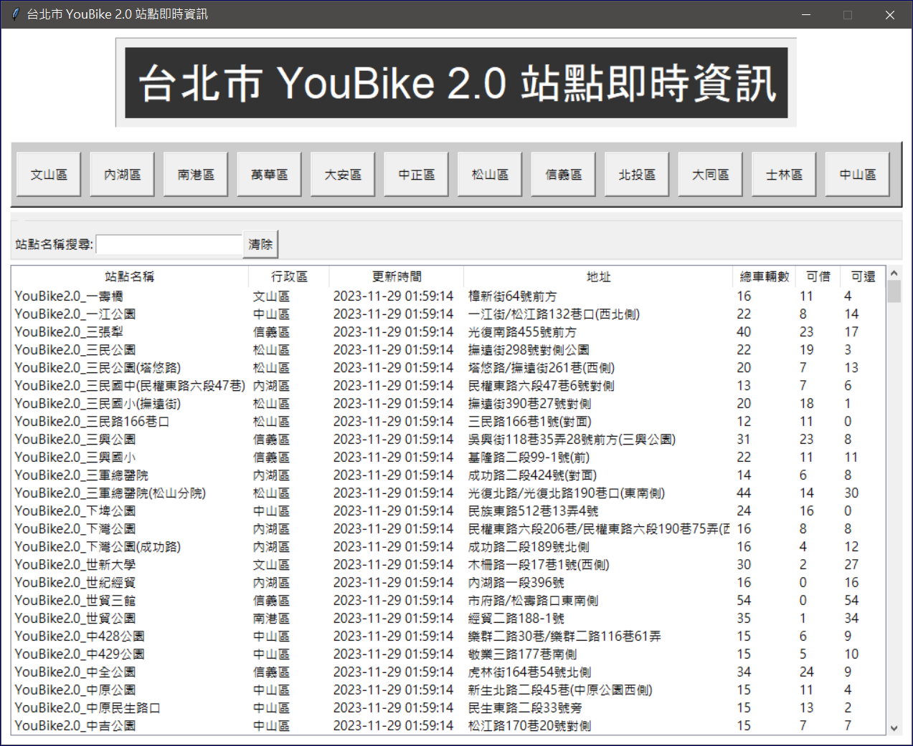
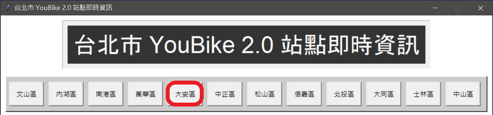
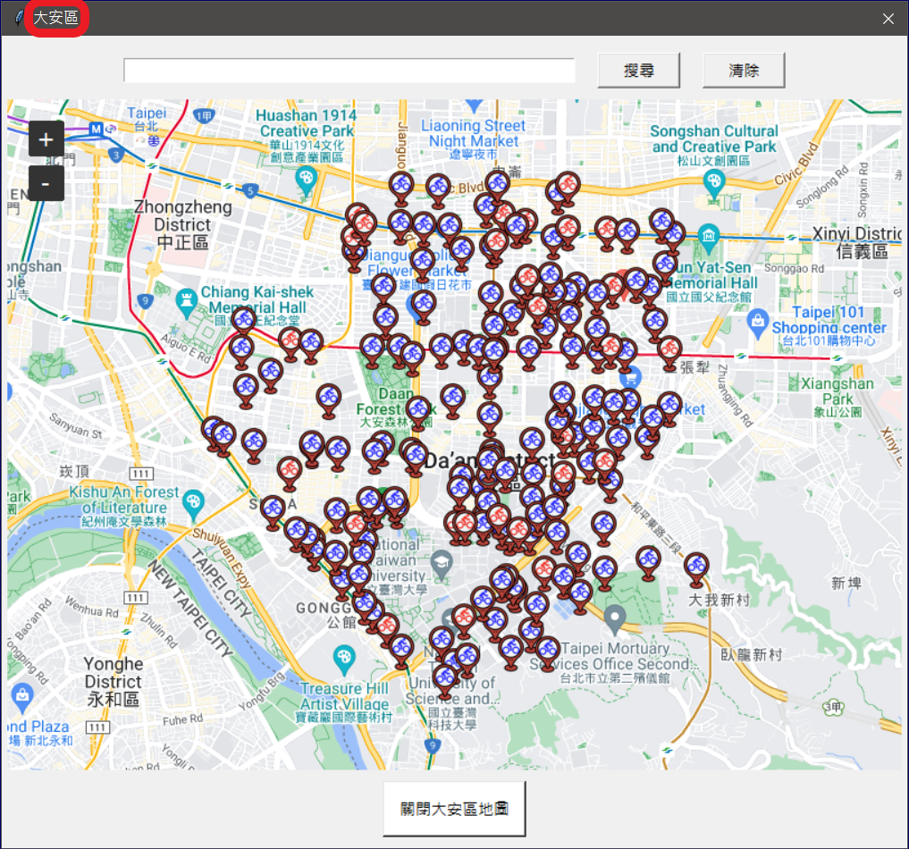
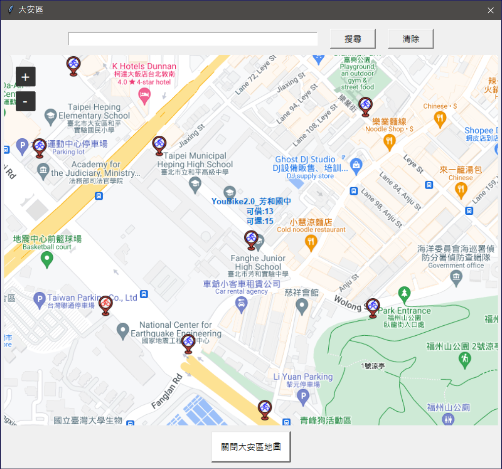
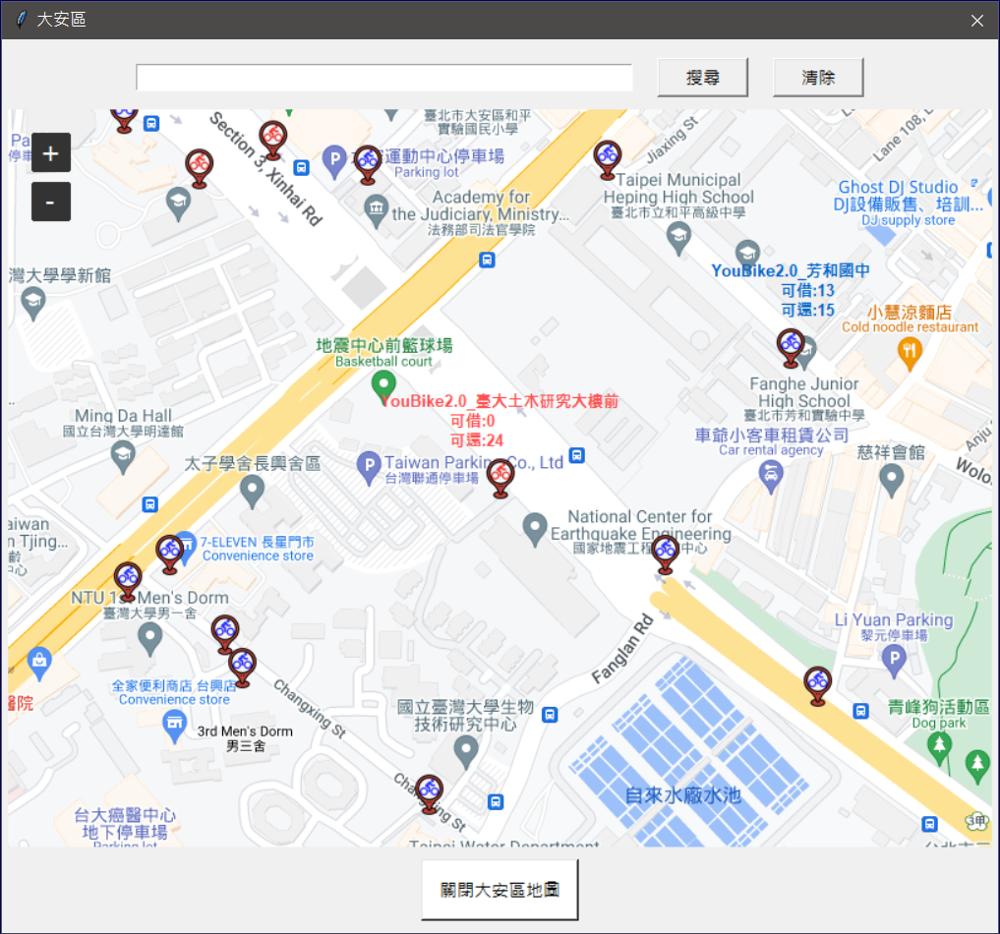
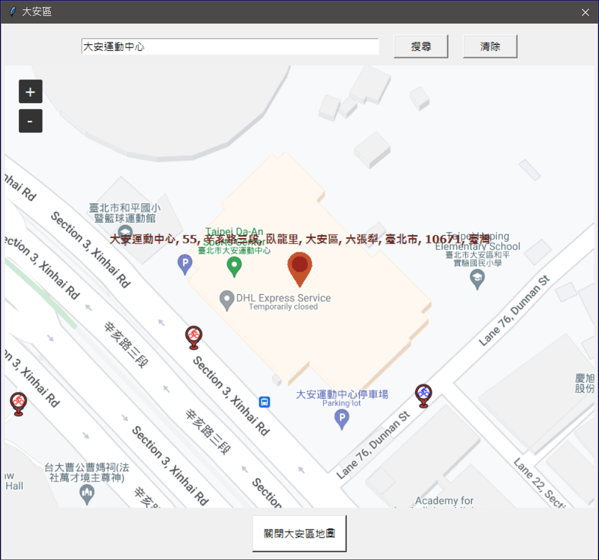
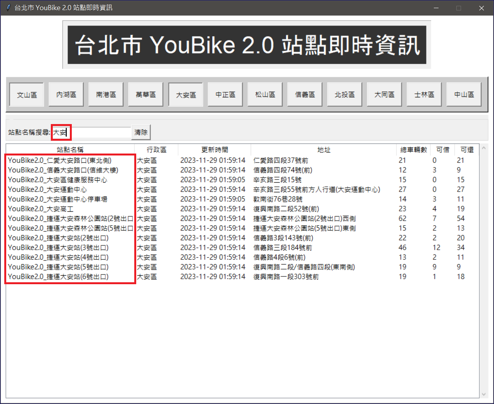
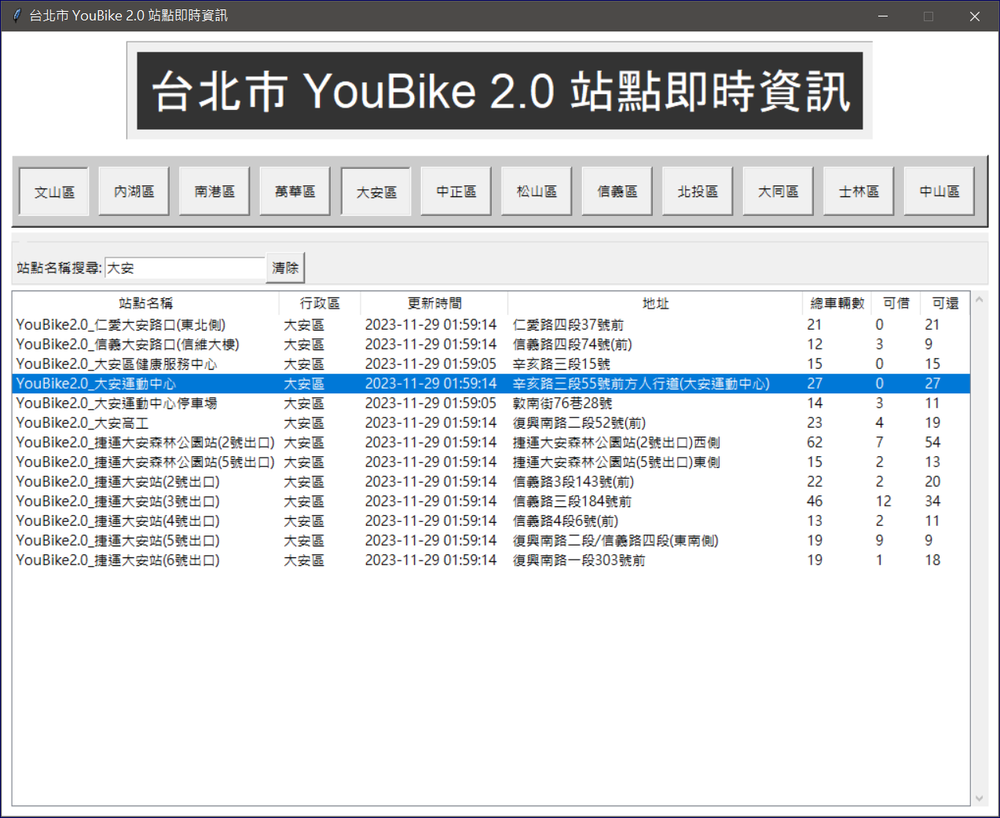
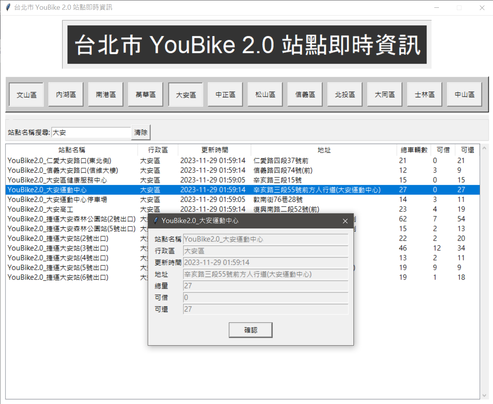

# 台北市YouBike站點即時資訊
### 一、專案名稱：
台北市YouBike站點即時資訊
### 二、專案組員：
張盛枋、劉峻宏、陳建任
### 三、專案目的：
查詢台北市YouBike站點即時資訊
### 四、專案簡介：
1. 主視窗：台北市 YouBike 2.0 站點即時資訊

2. 主視窗的上方，點擊行政區按鈕，例如：大安區​

🔽地圖就會顯示這個行政區的大致範圍 (畫面自動置中)，以及顯示腳踏車的圖示，代表此區內的所有 YouBike 2.0 站點位置。

3. 點擊腳踏車圖示後才會在圖示上方顯示站點名稱、可借的車輛數、可還的車輛數。

🔽目前無車可借時，站點改為紅色圖示顯示​

4. YouBike地圖搜尋. 例如：大安運動中心

5. 站點名稱搜尋. 例如：大安

6. ​個別站點資訊顯示：  
點擊想查詢的站點，例如："大安運動中心"

🔽​就會顯示個別站點資訊

### 五、影片展示：
[台北市YouBike站點即時資訊 操作影片](https://drive.google.com/file/d/1_rwx7BuytMjjlnaRGXOwUhdNuwp5Bq6C/view)
### 六、資料來源：
[YouBike2.0臺北市公共自行車即時資訊 | 政府資料開放平臺](https://data.gov.tw/dataset/137993)