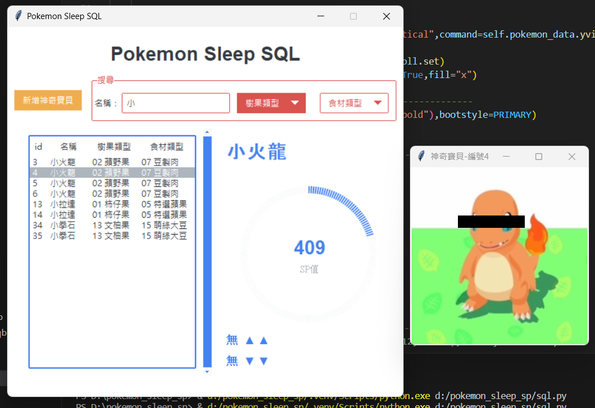
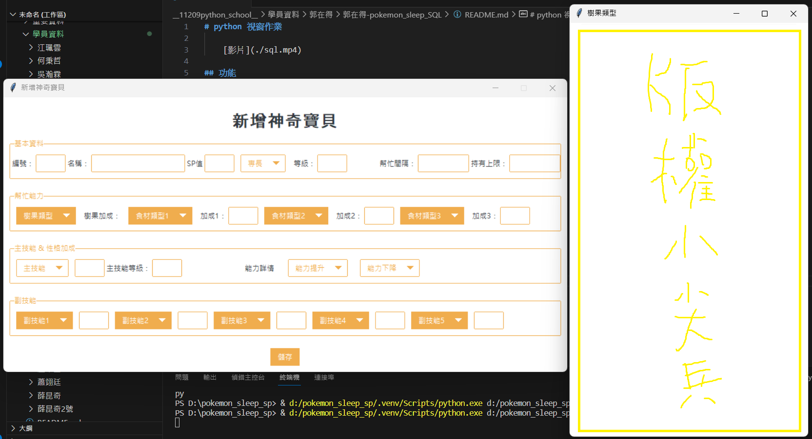

# python 視窗作業 ：pokeom sleep SQL

[影片](./sql.mp4)

## 用途

1. 我平日查詢資料用 => 介面只顯示我需要知道的訊息，不提供該神奇寶貝所有基本資料。

2. 未來分析資料用。

## 功能

### 搜尋神奇寶貝名稱、樹果類型、食材種類，並顯示神奇寶貝基本資料

    搜尋神奇寶貝名稱、樹果類型、食材種類為我平日會使用到的搜尋內容。

    註1 - sp meter：該神奇寶貝sp值/2000。
    
    註2 - 性格特色：影響神奇寶貝能力的重要指標。

### 新增神奇寶貝

    上面所有的項目為此遊戲提供的所有可能影響sp值的資料。
    
    註1 - 點「樹果加成」會跑出樹果圖鑑。

