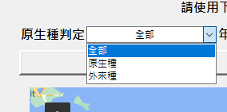
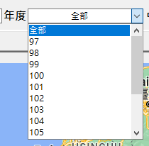
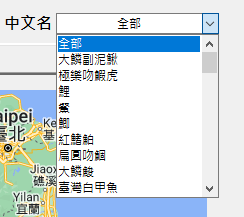
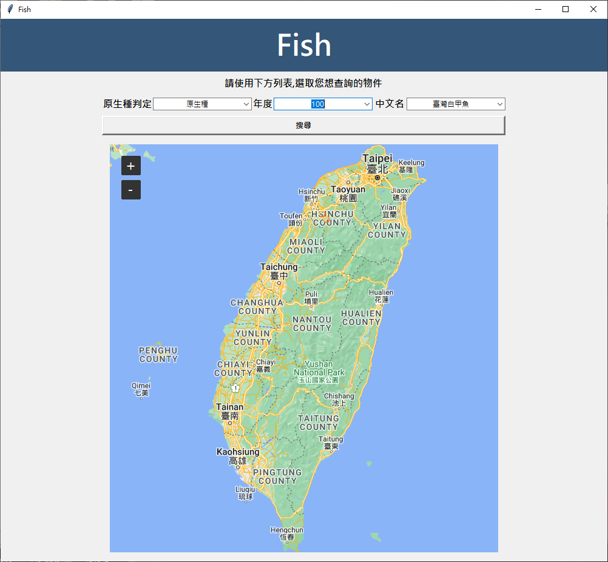

### 組員 何秉哲_陳宇彣_江珮雲

 # 🐠 台灣魚類資料庫 🐠 #

#### 這是一個查詢台灣原生種與外來種的視窗地圖
###### 資料由97年至112年

# 🐳🐳🐳 資料量有點大,請不要將搜尋列全部點選全部 🐳🐳🐳 #

## 操作步驟 🐡

# 🦈 1. 從下拉式選單選擇您想要的原生種判定

# 🐙 2. 點選您想要搜尋的年度

# 🦞 3. 從下拉式選單選擇您想要的魚類

# 🐋 4. 點選搜尋鍵 顯示分布地圖 

## 影片展示
[VIDEO](https://drive.google.com/file/d/1eTGCMeA-darlGWQZx6rbAgDE1KnfOp4f/view?t=6s)
